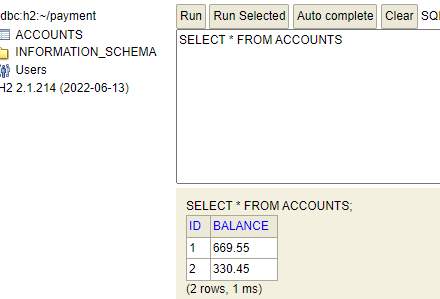
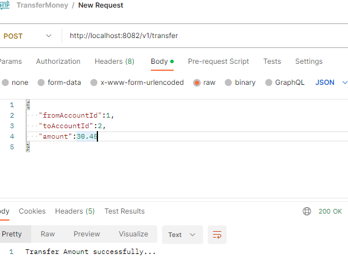

### Money Transfer Api
This REST Api used for money transfer from Source to Destination account with the help of Spring Boot framework.

### Prerequisite to compile this application
* Gradle build tool.
* JDK 8+ onwards.
* H2 In memory database.

### Feature and API Information

* Post Transaction between two accounts.
* Method : POST
* PATH   : /v1/transfer

### Library uses

* data-jpa
* validation
* web
* rxjava:2.1.14
* xandroid:2.0.2
* junit:4.13.1
* lombok
* h2
### Error Code
* Error Code: CLIENT_ERROR_001

* Description : This error occurs when end user passing wrong input data for business.

### Steps to run main application
* Download/Checkout the code as zip file.
* Extract code from zio and Import into IDE.
* Make sure all compilation error resolved.
* Configure H2 database setup based in application.properties file.
* Insert some data into table.

* Run the main ChallengeApplication file and validate all negative scenario.
* Install Postman plugin and create new post request http://localhost:8082/v1/transfer by passing valid input and hit send.

### To run JUnit test case 

* Right click as run TransferServiceTest and check the log in console result.